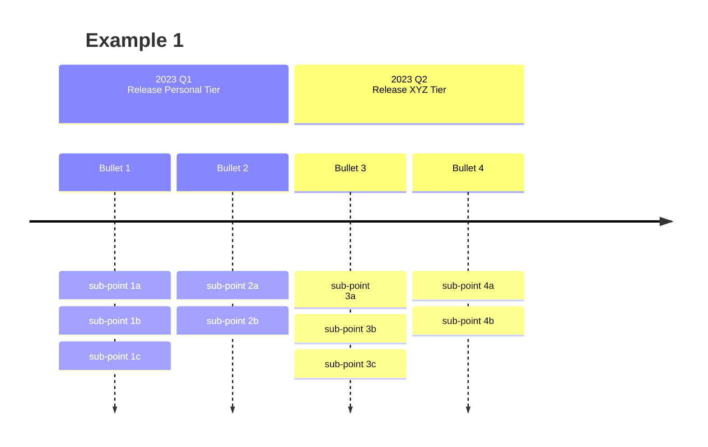
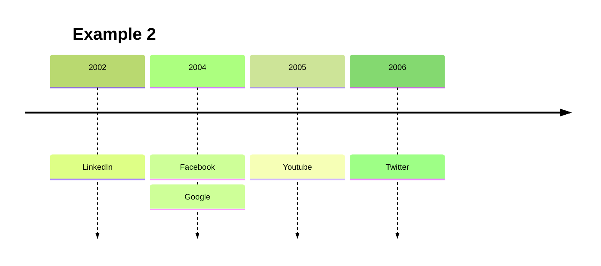
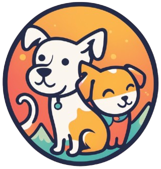
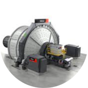
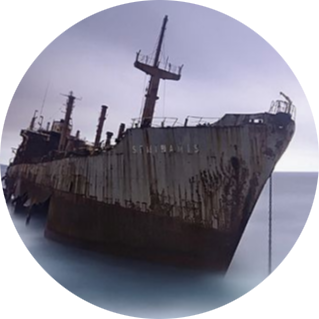
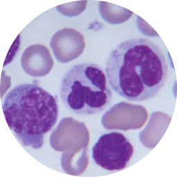
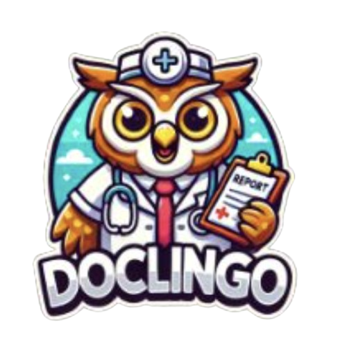
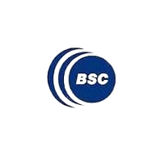

<h1> Hi there! 👋 </h1>

## About me

I am *Vero*, Italian based in Barcelona.

Building Engineer turned AI Engineer with a passion for exploring the realms of *Machine Learning* and *Artificial Intelligence*.

         

## Experiences

## Projects

<table style="width: 100%; border-collapse: collapse; table-layout: fixed;">
  <tr>
    <!-- First Project -->
    <td style="padding: 5px; vertical-align: top; height: 300px;"> <!-- Adjust height as needed -->
      <h3>PawsPal! 🐾</h3>
      
<em>Find your perfect Pawtner!</em>

      
      

        #python #llama3.1 #langchain #chroma #streamlit #CI/CD
      

      
 Pet Project 2021

    <!-- Second Project -->
    <td style="padding: 5px; vertical-align: top; height: 300px;">
      <h3>SAG-Mill 📈</h3>
      
<em>Time Series Long short term Memory</em>

      
      

        #python #timeseries #LSTM #tensorflow #keras
      

      
 Tech Interview 2021

    </td>
    <!-- Third Project -->
    <td style="padding: 5px; vertical-align: top; height: 300px;">
      <h3>Titanic 🛳️</h3>
      
<em>The legendary Kaggle competition</em>

      
      

        #python #notebooks #kaggle #sklearn #pandas #seaborn
      

      
 Personal Project 2021

    </td>
    <!-- Fourth Project -->
    <td style="padding: 5px; vertical-align: top; height: 300px;">
      <h3>ANNa 🧠</h3>
      
<em>Artificial Neural Network anti-leukemia</em>

      
      

        #python #googlecolab #opencv #sklearn #sklearn #tensorflow
      

      
 Final Project IronHack 2020

    </td>
  </tr>
</table>

| Date | Logo | Title | Description | Type | Stack |
|------|------|-------|-------------|------|---------|
| 2024 |  | [🐾 PawsPal!](https://github.com/cucu-o0/paws-pal) | Find your perfect Pawtner! | Pet Project |     |
| 2021 |  | [⚙️ SAG-Mill](https://github.com/cucu-o0/SAG-Mill) | Time Series Long short term Memory | Tech Interview |     |
| 2021 |  | [🧊 Titanic](https://drive.google.com/drive/u/1/folders/11Z8Y15rVWJ9m-ZBSfprtLk0oRYxpX0q7) | The legendary Kaggle competition | Personal Project |     |
| 2020 |  | [🧠 ANNa](https://drive.google.com/file/d/1GIPx9gteXYtnzZqV_5Xf3pdDmMsKStV_/view?usp=sharing) | Artificial Neural Network anti-leukemia | Final Project IronHack |      |

## Hackatons
| Date | Logo | Title | Description | Hackathon | Collaborators |
|------|------|-------|-------------|-----------|---------------|
| 2024 |  | [🩺 Doclingo](https://github.com/alabarga/hackbcn-2024) | Decoding Medical Jargon with AI | @[HackBarna - AI Edition](https://www.hackbarna.com/en) | @[Alberto Labarga](https://www.linkedin.com/in/albertolabarga/)  @[Romina Mendez](https://www.linkedin.com/in/mendezromina/) |
| 2023 |  | [🔍 Sex Bias in Research](hackatons/FINAL_PRESENTATION_15_12_23.pptx) | Is Sex Representation In Biological Research Experiments Adequately Funded? |@[2nd BioHackathon Germany](https://www.denbi.de/de-nbi-events/1547-biohackathon-germany-2) | @[Barcelona Supercomputing Center](https://www.bsc.es/) |

## Contacts 
📬 veronica.agnolutto@gmail.com   

    
    <a href="https://www.linkedin.com/in/veroagnolutto/" style="text-decoration: none; margin-left: 4px; display: inline-block; vertical-align: middle;">vero agnolutto</a>

## Hobbies
🌊 Openwater swimmer wannabe  
🐶 Volunteer @[Centro de Acogida de Animales de Compañía de Barcelona](https://ajuntament.barcelona.cat/benestaranimal/es/centro-de-acogida-de-animales-de-compania-caacb)  

