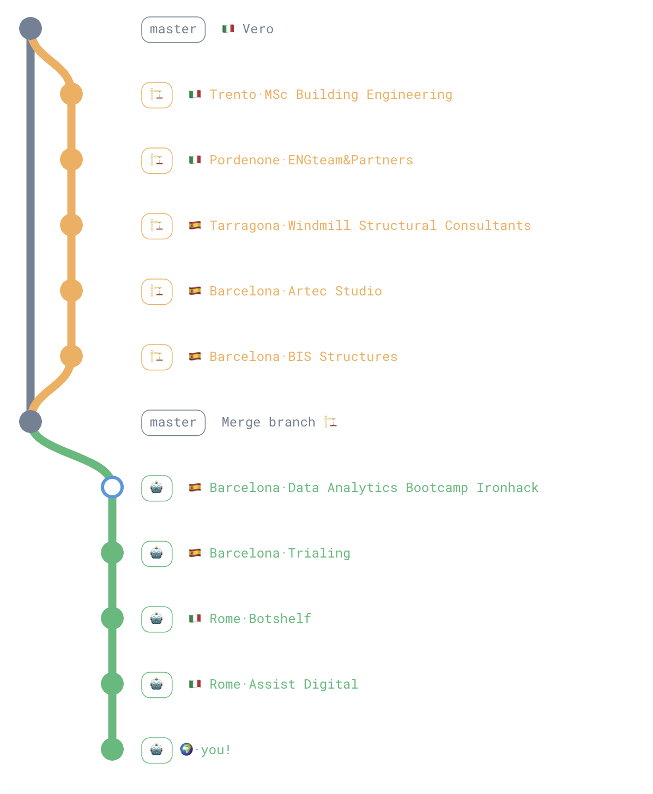

<h1> Hi there! 👋 </h1>

## About me

I am *Vero*, a Building Engineer turned AI Engineer.
  - 🎓  Building Engineer turned AI Engineer  @~~[Trialiang](https://www.trialing.org/)~~ @~~[botshelf](https://botshelf.ai/)~~ @[Assist Digital](https://assistdigital.com/)

### Interests

  data
  open-source
  machine·deep learning
  computer vision
  generative AI
  data engineering
  MLOps
  AI for Medicine
  AI for Good

## Experiences

  
   
  <a href="https://git-graph-creator.netlify.app/" style="font-size: 10px; color: grey;">https://git-graph-creator.netlify.app/</a>

## Projects

  <!-- First Container -->
  

    <h2>PawsPal! 🐾</h2>
    
<em>Find your perfect Pawtner!</em>

    
    <!-- Tags Section with Border and Title -->
    
Skills

    

      python
      llama 3.1
      langchain
      

          chroma
          streamlit
          
    
    <a href="https://www.linkedin.com/in/veroagnolutto/" style="text-decoration: none; margin-left: 4px; display: inline-block; vertical-align: middle;">vero agnolutto</a>

## Hobbies
🐶 Volunteer @[Centro de Acogida de Animales de Compañía de Barcelona](https://ajuntament.barcelona.cat/benestaranimal/es/centro-de-acogida-de-animales-de-compania-caacb)  
🌊 Open-water swimmer wannabe

