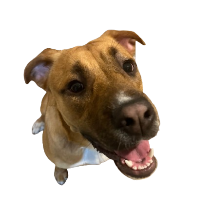

<h1> Hi there! 👋 </h1>

## About me

I’m **Vero**, an Italian **AI Engineer** from Barcelona. With a background in Building Engineering, I’ve been diving into the world of AI since the pandemic. I’m passionate about using AI to tackle real-world challenges, with a focus on *healthcare* and *sustainability*!

### Stack

         

### Projects

| Date | Title | Description |   Type    |     Stack     |
|------|-------|-------------|-----------|---------------|
| 2024 | [🾠 PawsPal!](https://github.com/cucu-o0/paws-pal) | Find your perfect Pawtner! | Pet Project |     |
| 2021 | [⚙️  SAG-Mill](https://github.com/cucu-o0/SAG-Mill) | Time Series Long short term Memory | Tech Interview |     |
| 2021 | [🧊  Titanic](https://drive.google.com/drive/u/1/folders/11Z8Y15rVWJ9m-ZBSfprtLk0oRYxpX0q7) | The legendary Kaggle competition | Personal Project |     |
| 2020 | [🧠  ANNa](https://drive.google.com/file/d/1GIPx9gteXYtnzZqV_5Xf3pdDmMsKStV_/view?usp=sharing) | Artificial Neural Network anti-leukemia | Final Project IronHack |      |

### Hackatons

| Date | Title | Description | Hackathon | Collaborators |
|------|-------|-------------|-----------|---------------|
| 2024 | [🩺 Doclingo](https://github.com/alabarga/hackbcn-2024) | Decoding Medical Jargon with AI | @[HackBarna - AI Edition](https://www.hackbarna.com/en) | @[Alberto Labarga](https://www.linkedin.com/in/albertolabarga/)  @[Romina Mendez](https://www.linkedin.com/in/mendezromina/) |
| 2023 | [🔍 Sex Bias in Research](hackatons/FINAL_PRESENTATION_15_12_23.pptx) | Is Sex Representation In Biological Research Experiments Adequately Funded? |@[2nd BioHackathon Germany](https://www.denbi.de/de-nbi-events/1547-biohackathon-germany-2) | @[Barcelona Supercomputing Center](https://www.bsc.es/) |

### Experiences

```mermaid
  %%{init: { 'logLevel': 'debug', 'theme': 'base', 'timeline': {'disableMulticolor': true}}}%%
  timeline
    section 🏗️ Construction
      Education : 🇮🇹 Trento <br> MSc Building Engineering 
                : 🇮🇹 Florence <br> Master ABITA (Bioecological Architecture and Technology)
                : 🇪🇸 Barcelona <br> Postgrads Structural Engineering 
      Work : 🇮🇹 Pordenone <br> ENGteam&Partners 
          : 🇪🇸 Tarragona <br> Windmill Structural Consultants
          : 🇪🇸 Barcelona <br> Artec Studio
          : 🇪🇸 Barcelona <br> BIS structures
    section 🤖 Data
      Education : 🇪🇸 Barcelona <br> Data Analytics Bootcamp Ironhack
                : 💻 DeepLearning.AI <br> Machine Learning Specialization 
                : 💻 DeepLearning.AI <br> Generative AI for Software Development 
                : 💻 Microsoft <br> AZ-900 Microsoft Azure Fundamentals <br> - in progress
      Work : 🇪🇸 Barcelona <br> Trialing
          : 🇮🇹 Rome <br> Botshelf.ai
          : 🇮🇹 Rome <br> Assist Digital
```

  
A brief look at my journey up to now

   

  For further information, please check out my [Linkedin](https://www.linkedin.com/in/veroagnolutto/) profile.

### Hobbies

🌊 Open water swimmer wannabe  
🍞 Handcrafted breadmaker  
🐶 Volunteer @[Centro de Acogida de Animales de Compañía de Barcelona](https://ajuntament.barcelona.cat/benestaranimal/es/centro-de-acogida-de-animales-de-compania-caacb)   
🎾 Matilde's coach   

  
Meet Matilde

  

###  Contacts 

📬 veronica.agnolutto@gmail.com   

    
    <a href="https://www.linkedin.com/in/veroagnolutto/" style="text-decoration: none; margin-left: 4px; display: inline-block; vertical-align: middle;">vero agnolutto</a>
  
📍 [matilde](https://www.google.com/maps/place/%C3%80rea+per+a+gossos+de+la+platja+de+Llevant/@41.405468,2.219722,17z/data=!3m1!4b1!4m6!3m5!1s0x12a4a33d02550785:0x70c740991937c2f6!8m2!3d41.405468!4d2.219722!16s%2Fg%2F11thrz11qk?entry=ttu&g_ep=EgoyMDI0MTExMy4xIKXMDSoASAFQAw%3D%3D)

